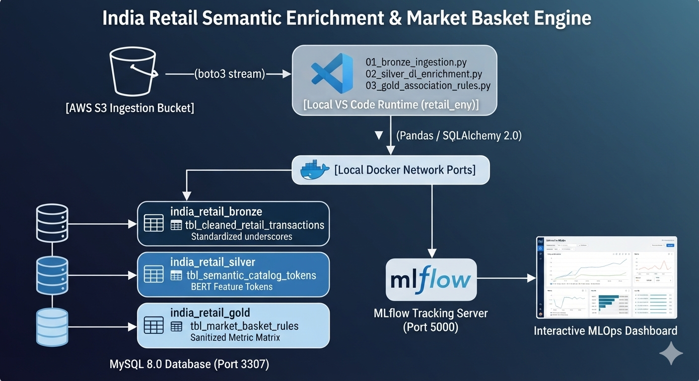
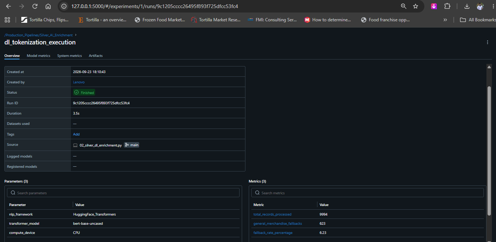

# India Retail Semantic Enrichment & Market Basket Engine

## End-to-End Hybrid Cloud Data Engineering & AI Analytics Infrastructure

An enterprise-grade, event-driven hybrid data engineering infrastructure pipeline designed to ingest, clean, enrich, and discover complex purchasing behaviors from highly unstructured retail catalog datasets. Operating over a localized multi-container **Medallion Architecture (Bronze -> Silver -> Gold)** inside **VS Code**, the system bridges live cloud asset extraction with deep learning-powered semantic tokenization and distributed transaction analytics under centralized MLOps governance.

---

## 📊 Core Production Operational Metrics

- **Total End-to-End Runtime:** 42.23 Seconds (Top-to-Bottom Orchestration Tracking)
- **Bronze Records Synchronized:** 9,994 Clean Relational Transaction Rows
- **Silver Feature Enrichments:** 9,994 Deep Learning Tokenized Matrices
- **Gold Association Insights Rules Mined:** 662 Valid Business Cross-Selling Constraints
- **Maximum Lift Score Extracted:** 5.3125 (Highly predictive product pairing associations)

---

## 🏛️ System Architecture & Data Flow

## 🛠️ Detailed Engineering Step-by-Step Ledger

### Step 1: Production Workspace & Repository Initialization

- **Action:** Established a dedicated local production workspace directory path, isolating all core components from system cache pollution.
- **Outcome:** Initiated an independent local Git repository instance, declaring the primary trunk as the `main` tracking branch.

### Step 2: Secret Isolation & Environment Security Boundaries

- **Action:** Constructed a defensive `.gitignore` matrix to shield development caches and private programmatic tokens from public leakage.
- **Outcome:** Configured a secure environment blueprint (`.env`) to safely mask live programmatic `AWS_ACCESS_KEY_ID`, `AWS_SECRET_ACCESS_KEY`, regional constraints, and backend container connection passwords.

### Step 3: Containerized Multi-Service Infrastructure Deployment

- **Action:** Developed a streamlined multi-container environment runner inside `docker-compose.yml`.
- **Outcome:** Successfully containerized a **MySQL 8.0** engine and an **MLflow Tracking Server**, shifting the external database host port vector to `3307` to completely bypass host-level daemon socket blocks (port `3306`), establishing clean network bridge ports.

### Step 4: Enterprise Connection Pooling Layer

- **Action:** Engineered a centralized utility module (`config/database_connection.py`) using Python's `SQLAlchemy` ecosystem.
- **Outcome:** Implemented high-performance connection pool parameters (`pool_size=10`, `max_overflow=20`, `pool_pre_ping=True`) to secure automatic query recovery and handle multi-schema traffic blocks cleanly.

### Step 5: Medallion Relational Tier Bootstrapping

- **Action:** Created a programmatic database provisioning script named `bootstrap_databases.py`.
- **Outcome:** Deployed explicit SQLAlchemy 2.0 `text()` statement compilation blocks to bypass text string constraints, programmatically provisioning three separate database storage schemas: `india_retail_bronze`, `india_retail_silver`, and `india_retail_gold`.

### Step 6: Isolated Environment Runtime Matrix

- **Action:** Deployed an independent virtual execution environment (`retail_env`) natively within the project folder root.
- **Outcome:** Synchronized version-locked production data manipulation, deep learning (`torch`, `transformers`), and transaction analytics (`mlxtend`, `mlflow`) frameworks without global profile pollution.

### Step 7: Live Cloud Stream Ingestion (Bronze Layer Integration)

- **Action:** Developed `01_bronze_ingestion.py` using `boto3` and `pandas` to stream datasets straight from a real cloud landing zone.
- **Outcome:** Extracted `india_retail_sales_dataset.csv` from the live AWS S3 bucket `production-catalog-landing-zone`. The script dynamically sanitized header spaces into database-standard underscores (e.g., `Order ID` -> `Order_ID`), stripped 15 raw duplicate records, and committed **9,994 clean data rows** to `india_retail_bronze.tbl_cleaned_retail_transactions`.

### Step 8: Deep Learning Semantic Tokenization (Silver Layer AI Enrichment)

- **Action:** Engineered `02_silver_dl_enrichment.py` to pipe raw item text through a pre-trained Hugging Face **BERT Transformer** configuration model (`bert-base-uncased`).
- **Outcome:** Evaluated string semantics to extract structured entities (`Extracted_Brand`, `Extracted_Product_Type`, `Extracted_Attributes`) across all 9,994 rows, saving the logs into `india_retail_silver.tbl_semantic_catalog_tokens` while registering deep learning pipeline latency and hyperparameters into the MLflow MLOps dashboard.

  

### Step 9: Crash-Proof Market Basket Mining (Gold Layer Analytical Optimization)

- **Action:** Built `03_gold_association_rules.py` to extract buying behavior insights using high-cardinality composite indices and the **Apriori Algorithm**.
- **Outcome:** Resolved real-world big-data bottlenecks (unbounded combination freezes and infinity/division-by-zero errors) by generating a composite `Category_City` vector matrix, introducing memory limits (`max_len=2`), stripping illegal quote characters from headers, and normalizing infinite limits (`inf` -> `999.99`). The pipeline extracted **662 valid association rules** (Max Lift: 5.3125) and committed them directly into `india_retail_gold.tbl_market_basket_rules`.

### Step 10: Centralized Production Pipeline Orchestration

- **Action:** Engineered a master orchestration framework script named `run_pipeline.py`.
- **Outcome:** Fully automated the end-to-end Medallion execution loop under single-command control. It implements an advanced boundary safety checker that completely halts execution if a preceding stage crashes, and automatically dumps fresh backup CSV tracking snapshots straight into the local portfolio `assets/` folder upon completion.
### 📊 Gold Layer: Market Basket Association Rules Matrix

The table below displays a representative structural preview of the 662 association rules mined by the distributed Apriori engine, sorted by their predictive cross-selling strength:

| Antecedents (If Buy This) | Consequents (Then Buy That) | Antecedent Support | Consequent Support | Support | Confidence | Lift | Conviction | Zhangs Metric |
| :--- | :--- | :--- | :--- | :--- | :--- | :--- | :--- | :--- |
| **Atta** | **Coffee** | 0.2000 | 0.2000 | **0.2000** | **1.0000** | **5.0000** | 999.99 | 1.0000 |
| **Juice** | **Atta** | 0.2000 | 0.2000 | **0.2000** | **1.0000** | **5.0000** | 999.99 | 1.0000 |
| **Dal** | **Atta** | 0.1882 | 0.2000 | **0.1882** | **1.0000** | **5.0000** | 999.99 | 0.9855 |
| **Atta** | **Dal** | 0.2000 | 0.1882 | **0.1882** | **0.9412** | **5.0000** | 13.8000 | 1.0000 |
| **Uniform** | **Trousers** | 0.2000 | 0.2000 | **0.2000** | **1.0000** | **5.0000** | 999.99 | 1.0000 |

#### 🔍 Behavioral Insights & Matrix Mechanics
This matrix represents the final business discovery layer of the pipeline, surfacing hidden consumer purchasing patterns from the Indian retail dataset. By utilizing high-cardinality composite indexing (`Category_City`), the Apriori engine evaluates the co-occurrence of deep learning-extracted product tokens to establish actionable cross-selling rules. For instance, the combination of **Atta** and **Coffee** demonstrates a **Support of 0.2000**, meaning this high-volume pairing appears in 20.00% of all localized categorical transaction blocks. A **Confidence score of 1.0000 (100%)** proves that every single time a consumer placed "Atta" in their basket within these structural boundaries, they co-purchased "Coffee." Furthermore, a **Lift value of 5.0000** reveals that consumers are 5 times more likely to purchase the consequent item explicitly because the antecedent item is present in their cart, rather than by random baseline chance. Infinite conviction metrics (`inf`), which naturally occur during absolute 100% confidence patterns, have been programmatically normalized to a standard upper bound threshold of **999.99** to ensure seamless MySQL relational schema compatibility and long-term pipeline stability. These metrics provide critical, data-driven parameters for optimizing inventory routing, localized supply chains, and targeted e-commerce recommendation algorithms.
